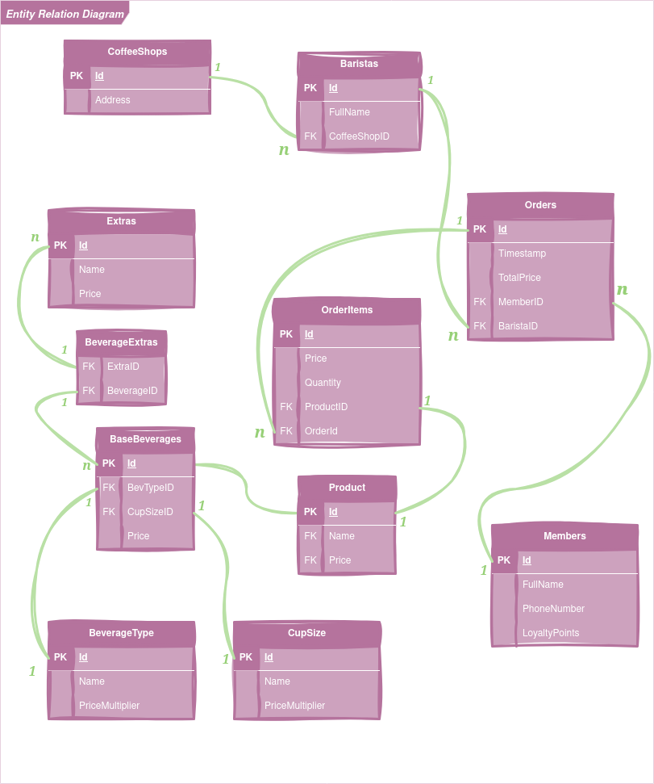

## Problem 1 - Solution Breakdown

- The membership system based on loyalty points is comprised of a **Member** object that holds information about the customer, the list of all order history, keeps track of their loyalty points count and of their member status.  

- The membership status is decided through **Strategy Pattern**, where the point conversion from order total to amount of points differs from level to level of their membership. This allows for further extension to multiple levels of membership.  

- The beverage customization system was divided into a **base beverage** that can be a combination of a beverage type (e.g. espresso, cappuccino, latte) and a cup size (Small, Medium, Large). For additional topping and such, there is a list of items for each customized beverage.  

- The **customized beverage item** is a concrete implementation for a `Product`. This allows for further menu extension, where `Product` can be any other item (e.g. pastry, juice, tea).  

- An **OrderItem** is an object added to the order by the barista, which has information about the product name, quantity and price (dependent on quantity).  

- An **Order** object will contain information about the order put in by the barista, identified in the object by BaristaID, the timestamp, the order total price, the MemberID in case the customer is a member and scans their ID, and list of order items.  

- Converting points into redeemable free drinks was solved also through **Strategy Pattern**, so that conditions of any other added rewards can be different (e.g. different requirement for different drink sizes, the reward can also be a percentage off an order).  

- Two separate strategy interfaces were proposed for the accumulation of loyalty points system and redeeming rewards system to account for the fact that each functionality needs to be easily expandable.

 .png)
 
